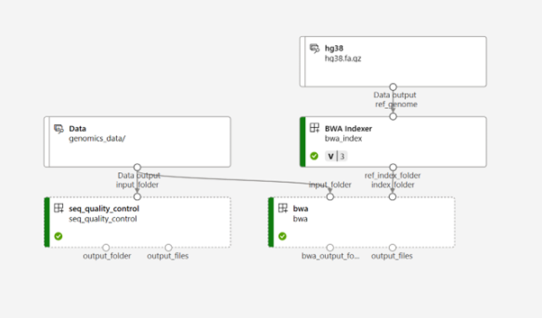

# Azure ML for Genomics Pipelines

This is an Azure Machine Learning (Azure ML) pipeline that runs an example genomics workflow using AML v2. The pipeline consists of three jobs, two of which run in parallel. The first job, seq_quality_control, performs quality control on input sequence data using the FastQC tool. The second job, bwa_index, creates an index for the reference genome used in the alignment step. Once the index is created, the third job, bwa, kicks off and aligns the input sequence data to the reference genome using the Burrows-Wheeler Aligner (BWA) tool. This BWA step processes paired input fastqc.gz reads in parallel across multiple nodes of an Azure ML cluster with auto-scale.

## Pipeline Architecture

The pipeline is defined as a YAML file, pipeline.yml, which can be executed in an Azure ML workspace. The pipeline runs on an elastic Azure ML compute cluster that is called "genomics-cluster" in this example, and the input and output data are stored in an Azure Blob Storage datastore associated with the same instance of an Azure ML workspace.

In this example, the human reference genome, hg38, is defined in AzureML as a versioned, centrally dataset in our ML workspace, which in turns point to a publicly available file. Also as input, I have a few input fastq files in my Azure ML workspaces’ default datastore. 

The pipeline is designed to handle large data sets and is optimized for parallel processing. The seq_quality_control and bwa jobs are run in parallel on multiple instances, each with a specified number of CPU threads (specified with bwa's -t parameter). The pipeline also includes retry settings in case of job failures and central logging to help diagnose issues.

Step 1 and 2 can start simultaneously as there are no interdependencies between them. Step 2 and 3 can process input files in parallel. Each step requires a different software environment, and these environments are also defined and registered in our Azure ML workspace. 

## Pipeline Jobs

- seq_quality_control

This job performs quality control on the input sequence data using the FastQC tool. The job runs in parallel on multiple nodes. The output of the job is stored in an Azure Blob Storage datastore. It leverages a fastqc environment registered in our workspace. This environment can be created using the environment.yml and Dockerfile contained within env-fastq folder.

This step uses the "parallel" mode, which requires a run script called "fastqc_parallel.py"/ Overall, this script is designed to run the fastqc tool on each input file in parallel, and generate the output report in the specified output folder.

- bwa_index

This job creates an index for the reference genome used in the alignment step. The job is run on a single instance as it cannot be run in parallel, and uses the BWA Indexer component registered by Azure ML. Pipeline components defined by users can be centrally registered so that they can be re-used in other pipelines. They are versioned and there is an audit log for which pipeline jobs have utilised them. The output of the job is stored in an Azure Blob Storage datastore, which can be accessed by any subsequent pipeline step.

- bwa

This job aligns the input sequence data to the reference genome using the BWA tool. The job runs in parallel on four instances, each with a single CPU thread. The output of the job is stored in an Azure Blob Storage datastore.

## Creating components and environments

To register the bwa_index component into an ML workspace called my-azureml-workspace, with version #3:

`az ml component create --file bwa_index.yml --workspace-name my-azureml-workspace --resource-group demo --version 3`

Similarly, an environment can be defined as follows:

`az ml environment create --file ./env-bwa/environment.yml --resource-group demo --workspace-name my-azureml-workspace --name bwa --version 5`

## Pipeline Inputs and Outputs

The pipeline takes input sequence data from an Azure Blob Storage datastore and outputs the quality control results and alignment output to another Azure Blob Storage datastore. The pipeline also creates a log file for each job, which is stored in the same Azure Blob Storage datastore as the job output.

## Running the Pipeline

To run this pipeline, you will need an Azure ML workspace and access to an Azure ML cluster. You will also need to provide the necessary input data and configure the pipeline YAML file accordingly.

Assuming your workspace is called my-azureml-workspace, the job can be submitted from the command line as follows:

`az ml job create --file pipeline.yml --workspace-name my-azureml-workspace --resource-group demo --web`

If course, this requires the az cli to be authenticated beforehand, for which one can run:

`az login`

Once you have set up your environment and configured the pipeline YAML file, you can submit the pipeline to Azure ML for execution. The pipeline will automatically provision the necessary resources and execute the jobs in the specified order.

## Conclusion

This pipeline is a powerful tool for analyzing large genomics data sets using parallel processing. With its ability to handle large data sets and retry failed jobs, the pipeline can help streamline the genomics analysis process and provide valuable insights into biological systems.